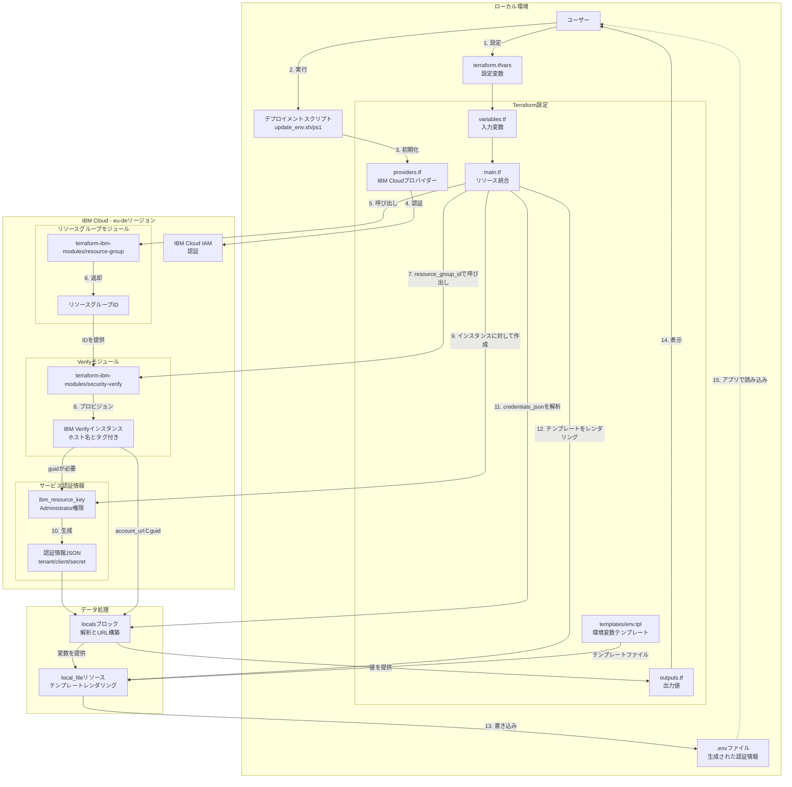

# IBM Verify を Terraform 使ってデプロイする

## IBM Verifyについて

[IBM Verify](https://www.ibm.com/products/verify)は、IDおよびアクセス管理（IAM）ソリューションです：

- **シングルサインオン（SSO）、多要素認証（MFA）、パスワードレス認証、ユーザーとグループのアクセス制御**

## このTerraform設定について

このリポジトリは、IBM VerifyのIBM Cloudへのデプロイを自動化するコードを提供します。Terraformを使用することで、手動セットアップが不要になり、以下を実現します：

- **自動プロビジョニング** - 単一のコマンドでIBM Verifyインスタンスをデプロイ
- **認証情報管理** - サービス認証情報と.envファイルの生成

**使用する公式IBMモジュール:**
- [terraform-ibm-modules/security-verify/ibm](https://registry.terraform.io/modules/terraform-ibm-modules/security-verify/ibm/latest) v1.1.1
- [terraform-ibm-modules/resource-group/ibm](https://registry.terraform.io/modules/terraform-ibm-modules/resource-group/ibm/latest) v1.1.6

## 前提条件

始める前に、以下をご用意ください：

1. **Terraform** がインストールされていること（バージョン1.0以上）
   - ダウンロード: https://developer.hashicorp.com/terraform/install

2. **IBM Cloudアカウント**
   - サインアップ: https://cloud.ibm.com/registration

3. **IBM Cloud APIキー**
   - 作成: https://cloud.ibm.com/iam/apikeys
   - このキーは、バージョン管理にコミットしないでください

## アーキテクチャ概要



## プロジェクト構成

```
.
├── providers.tf              # プロバイダー設定
├── variables.tf              # 変数定義
├── main.tf                   # メインのTerraform設定
├── outputs.tf                # 出力定義
├── templates/
│   └── env.tpl              # .envファイルのテンプレート
├── scripts/
│   ├── update_env.sh        # デプロイメントスクリプト（Linux/Mac）
│   ├── update_env.ps1       # デプロイメントスクリプト（Windows）
│   ├── destroy.sh           # 削除スクリプト（Linux/Mac）
│   └── destroy.ps1          # 削除スクリプト（Windows）
├── terraform.tfvars.example # 変数ファイルの例
├── README.md               # 英語版README
└── README.ja.md            # 日本語版README（このファイル）
```

### コンポーネントのワークフロー

1. **ユーザー設定**: `terraform.tfvars`に必要なパラメータを設定
2. **スクリプト実行**: デプロイメントスクリプトを実行してTerraformを操作
3. **プロバイダー初期化**: TerraformがIBM Cloudプロバイダーを初期化
4. **認証**: プロバイダーがIBM Cloud IAMで認証
5. **リソースグループモジュール呼び出し**: `main.tf`がresource-groupモジュールを呼び出し
6. **リソースグループID解決**: モジュールが解決されたリソースグループIDを返却
7. **Verifyモジュール呼び出し**: `main.tf`がresource_group_idを使用してsecurity-verifyモジュールを呼び出し
8. **インスタンスプロビジョニング**: モジュールがホスト名とタグを持つIBM Verifyインスタンスをプロビジョン
9. **認証情報リソース作成**: `main.tf`がインスタンス用の`ibm_resource_key`を作成
10. **認証情報生成**: リソースキーがAdministratorロールでJSON認証情報を生成
11. **データ解析**: `locals`ブロックがcredentials_jsonを解析してURLを構築
12. **テンプレートレンダリング**: `local_file`リソースが解析データを使用してテンプレートをレンダリング
13. **環境ファイル書き込み**: テンプレート出力が`.env`ファイルに書き込まれる
14. **出力表示**: `outputs.tf`がlocalsの値を使用してデプロイメント結果を表示
15. **アプリケーション統合**: アプリケーションで`.env`の認証情報を読み込み

## セットアップ手順

### ステップ1: 変数の設定

1. 例の変数ファイルをコピーします：
   ```bash
   cp terraform.tfvars.example terraform.tfvars
   ```

2. `terraform.tfvars`を編集して必須パラメータを設定します：
   ```hcl
   # 必須パラメータ
   ibmcloud_api_key = "your-ibm-cloud-api-key"
   resource_group   = "Default"  # またはリソースグループ名
   instance_name    = "my-verify-instance"
   hostname         = "mycompany"  # Verifyサブドメイン
   
   # オプションパラメータ
   # prefix = "verify"         # 新しいリソースグループ作成時に使用
   # region = "eu-de"          # デフォルト、IBM Verifyはeu-deのみ利用可能
   # resource_tags = ["env:dev", "project:myapp"]
   # access_tags = ["env:dev"]
   ```
   
   **注意:** `hostname`はダッシュボードURLの構築に使用されます：`https://<hostname>.verify.ibm.com/ui/admin/`

3. リソースグループ名を取得します（既存のものを使用する場合）：
   ```bash
   # 利用可能なリソースグループを一覧表示
   ibmcloud resource groups
   ```
   
   または`resource_group = null`に設定して自動的に新しいものを作成できます！（権限があれば）

### ステップ2: IBM Verifyインスタンスのデプロイ

#### オプションA: デプロイメントスクリプトの使用（推奨）

**Linux/Mac:**
```bash
chmod +x scripts/update_env.sh
./scripts/update_env.sh
```

**Windows（PowerShell）:**
```powershell
Set-ExecutionPolicy -ExecutionPolicy RemoteSigned -Scope CurrentUser
.\scripts\update_env.ps1
```

#### オプションB: 手動でTerraformコマンドを実行

1. Terraformを初期化します：
   ```bash
   terraform init
   ```

2. デプロイメントを計画します：
   ```bash
   terraform plan
   ```

3. 設定を適用します：
   ```bash
   terraform apply
   ```

### ステップ3: .envファイルの確認

デプロイメントが成功したら、プロジェクトルートの`.env`ファイルを確認してください。以下の内容が含まれているはずです：

```env
IBM_VERIFY_HOSTNAME=mycompany.verify.ibm.com
IBM_VERIFY_DASHBOARD_URL=https://mycompany.verify.ibm.com/ui/admin/
IBM_VERIFY_ACCOUNT_URL=https://mycompany.verify.ibm.com
IBM_VERIFY_INSTANCE_ID=<instance-guid>
```

### ステップ4: REST APIアクセスを有効化（デプロイが完了したら）

REST API自動化のために、管理コンソールでAPIクライアントを作成します：

1. `https://<hostname>.verify.ibm.com/ui/admin/security/api-access` にアクセス
2. 必要な権限で新しいAPIクライアントを作成
3. クライアントIDとクライアントシークレットを保存
4. 認証情報を `.env` ファイルに追加


## アウトプットの使用方法（おまけ）

### 出力の表示

すべての出力を表示するには：
```bash
terraform output
```

特定の出力を表示するには：
```bash
terraform output verify_hostname
```

機密性の高い出力を表示するには：
```bash
terraform output verify_tenant_id
```

### 設定の更新

1. `terraform.tfvars`の変数を変更します
2. `terraform apply`を実行してインフラを更新します

### インフラの削除

IBM Verifyインスタンスが不要になった場合：

**Linux/Mac:**
```bash
chmod +x scripts/destroy.sh
./scripts/destroy.sh
```

**Windows（PowerShell）:**
```powershell
.\scripts\destroy.ps1
```

または手動で：
```bash
terraform destroy
```


## 重要: リージョンの利用可能性

**IBM Verifyは`eu-de`（フランクフルト）リージョンでのみ利用可能です。**

他のリージョンへのデプロイを試みると、デプロイメントは失敗します。

## サービスプラン

サービスプランはIBM Verifyモジュールによって`verify-lite`に設定されます。これも固定です。

## 出力

デプロイ後、以下の出力が利用可能です：

- `verify_instance_id`: IBM Verifyインスタンスのリソースフル ID
- `verify_instance_guid`: IBM VerifyインスタンスのGUID
- `verify_hostname`: IBM Verifyインスタンスのホスト名
- `verify_dashboard_url`: ダッシュボードURL
- `verify_tenant_id`: テナントID（機密情報）
- `verify_oauth_url`: OAuthサーバーURL
- `verify_management_url`: 管理API URL

## トラブルシューティング

### リソースグループが見つからない

指定されたリソースグループが存在しない場合：
1. リソースグループを一覧表示します：`ibmcloud resource groups`
2. `terraform.tfvars`の`resource_group`を更新します
3. またはIBM Cloudで新しいリソースグループを作成します


## 環境ファイルの生成

Terraformは、アプリケーションに必要なすべての設定を含む`.env`ファイルを自動的に生成します：

```env
IBM_VERIFY_HOSTNAME=mycompany.verify.ibm.com
IBM_VERIFY_DASHBOARD_URL=https://mycompany.verify.ibm.com/ui/admin/
IBM_VERIFY_ACCOUNT_URL=https://mycompany.verify.ibm.com
IBM_VERIFY_API_ACCESS_URL=https://mycompany.verify.ibm.com/ui/admin/security/api-access
IBM_VERIFY_INSTANCE_ID=761a3384-06b8-4cde-ac4d-91bd0d535f7c
```

ファイルには、APIクライアント認証情報用のプレースホルダーコメントが含まれています（コンソールでAPIクライアントを作成後に追加）。`.env`ファイルは`terraform apply`を実行するたびに再生成されます。

## その他のリソース

### ドキュメント
- [IBM Cloud Terraformプロバイダー ドキュメント](https://registry.terraform.io/providers/IBM-Cloud/ibm/latest/docs)
- [IBM Verify ドキュメント](https://www.ibm.com/docs/en/security-verify)
- [IBM Verify APIリファレンス](https://www.ibm.com/docs/en/security-verify?topic=apis-overview)
- [Terraform ドキュメント](https://www.terraform.io/docs)
- [IBM Cloud CLI](https://cloud.ibm.com/docs/cli)


## クイックスタート

より簡単な手順については、[QUICKSTART.ja.md](QUICKSTART.ja.md)をご覧ください。

