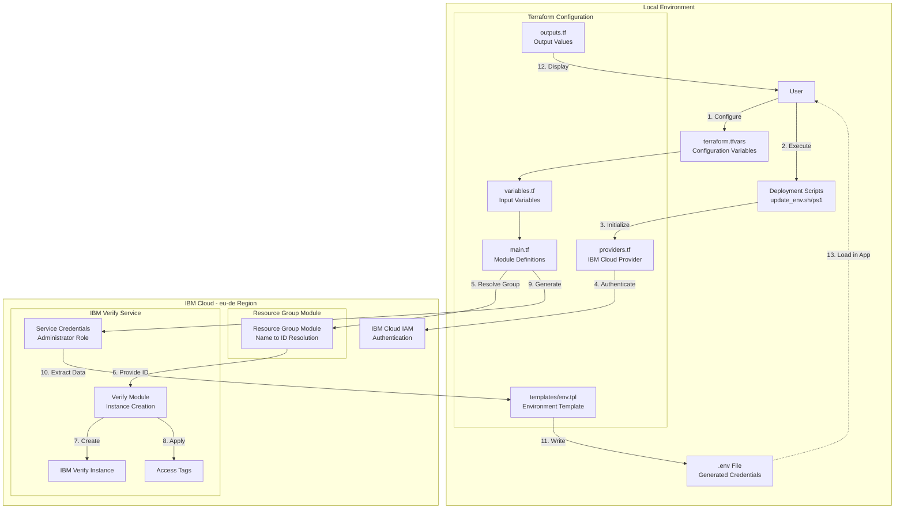

# IBM Verify Terraform Deployment

## About IBM Verify

[IBM Verify](https://www.ibm.com/products/verify) is a cloud-native identity and access management (IAM) solution that provides:

- **Single Sign-On (SSO)** - Unified access across applications
- **Multifactor Authentication (MFA)** - Enhanced security with SMS, TOTP, biometrics
- **Passwordless Authentication** - FIDO2 WebAuthn support
- **Adaptive Access** - AI-powered risk-based authentication
- **User Lifecycle Management** - Automated onboarding and access control
- **REST APIs** - Programmatic access for automation and integration

## About This Terraform Configuration

This repository provides infrastructure-as-code to automate IBM Verify deployment on IBM Cloud. Using Terraform eliminates manual setup and provides:

- **Automated Provisioning** - Deploy IBM Verify instances with a single command
- **Consistent Configuration** - Reproducible deployments across environments
- **Infrastructure as Code** - Version-controlled infrastructure
- **Automatic Credential Management** - Service credentials and .env file generation
- **Resource Group Integration** - Simplified resource organization
- **Hostname Automation** - Dashboard URLs automatically configured

**Using Official IBM Modules:**
- [terraform-ibm-modules/security-verify/ibm](https://registry.terraform.io/modules/terraform-ibm-modules/security-verify/ibm/latest) v1.1.1
- [terraform-ibm-modules/resource-group/ibm](https://registry.terraform.io/modules/terraform-ibm-modules/resource-group/ibm/latest) v1.1.6

**日本語ドキュメント**: [README.ja.md](README.ja.md) | [QUICKSTART.ja.md](QUICKSTART.ja.md)

## Prerequisites

Before you begin, ensure you have the following:

1. **Terraform** installed (version 1.0 or higher)
   - Download from: https://www.terraform.io/downloads

2. **IBM Cloud Account**
   - Sign up at: https://cloud.ibm.com/registration

3. **IBM Cloud API Key**
   - Create one at: https://cloud.ibm.com/iam/apikeys
   - Keep this key secure and never commit it to version control

## Architecture Overview



## Project Structure

```
.
├── providers.tf              # Provider configuration
├── variables.tf              # Variable definitions
├── main.tf                   # Main Terraform configuration
├── outputs.tf                # Output definitions
├── templates/
│   └── env.tpl              # Template for .env file
├── scripts/
│   ├── update_env.sh        # Deployment script (Linux/Mac)
│   ├── update_env.ps1       # Deployment script (Windows)
│   ├── destroy.sh           # Destroy script (Linux/Mac)
│   └── destroy.ps1          # Destroy script (Windows)
├── terraform.tfvars.example # Example variables file
├── .gitignore              # Git ignore rules
└── README.md               # This file
```

### Component Workflow

1. **User Configuration**: Configure `terraform.tfvars` with required parameters
2. **Script Execution**: Run deployment script to orchestrate Terraform
3. **Provider Initialization**: Terraform initializes IBM Cloud provider
4. **Authentication**: Provider authenticates with IBM Cloud IAM
5. **Resource Group Resolution**: Module converts resource group name to ID
6. **Module Provisioning**: Verify module receives resource group ID
7. **Instance Creation**: Create IBM Verify instance in eu-de region
8. **Access Tags Application**: Apply access tags to the instance
9. **Credential Generation**: Generate service credentials with Administrator role
10. **Data Extraction**: Extract hostname, URLs, and credentials
11. **Environment File Generation**: Write `.env` file with all configuration
12. **Output Display**: Show deployment results to user
13. **Application Integration**: Load `.env` credentials in your application

## Setup Instructions

### Step 1: Configure Variables

1. Copy the example variables file:
   ```bash
   cp terraform.tfvars.example terraform.tfvars
   ```

2. Edit `terraform.tfvars` and configure the required parameters:
   ```hcl
   # Required parameters
   ibmcloud_api_key = "your-ibm-cloud-api-key"
   resource_group   = "Default"  # Or your resource group name
   instance_name    = "my-verify-instance"
   hostname         = "mycompany"  # Your verify subdomain
   
   # Optional parameters
   # prefix = "verify"        # Used if creating new resource group
   # region = "eu-de"         # Default, IBM Verify only available in eu-de
   # resource_tags = ["env:dev", "project:myapp"]
   # access_tags = ["env:dev"]
   ```
   
   **Note:** The `hostname` is used to construct your dashboard URL: `https://<hostname>.verify.ibm.com/ui/admin/`

3. Get your Resource Group Name (if using existing):
   ```bash
   # List available resource groups
   ibmcloud resource groups
   ```
   
   Or set `resource_group = null` to create a new one automatically!

### Step 2: Deploy IBM Verify Instance

#### Option A: Using the Deployment Script (Recommended)

**Linux/Mac:**
```bash
chmod +x scripts/update_env.sh
./scripts/update_env.sh
```

**Windows (PowerShell):**
```powershell
Set-ExecutionPolicy -ExecutionPolicy RemoteSigned -Scope CurrentUser
.\scripts\update_env.ps1
```

#### Option B: Manual Terraform Commands

1. Initialize Terraform:
   ```bash
   terraform init
   ```

2. Plan the deployment:
   ```bash
   terraform plan
   ```

3. Apply the configuration:
   ```bash
   terraform apply
   ```

### Step 3: Verify the .env File

After successful deployment, check the `.env` file in your project root. It should contain:

```env
IBM_VERIFY_HOSTNAME=mycompany.verify.ibm.com
IBM_VERIFY_DASHBOARD_URL=https://mycompany.verify.ibm.com/ui/admin/
IBM_VERIFY_ACCOUNT_URL=https://mycompany.verify.ibm.com
IBM_VERIFY_INSTANCE_ID=<instance-guid>
```

### Step 4: Enable REST API Access (Optional)

For REST API automation, create an API client in the management console:

1. Navigate to: `https://<hostname>.verify.ibm.com/ui/admin/security/api-access`
2. Create a new API client with required permissions
3. Save the Client ID and Client Secret
4. Add credentials to your `.env` file


## Usage

### View Outputs

To view all outputs:
```bash
terraform output
```

To view a specific output:
```bash
terraform output verify_hostname
```

To view sensitive outputs:
```bash
terraform output verify_tenant_id
```

### Update Configuration

1. Modify variables in `terraform.tfvars`
2. Run `terraform apply` to update the infrastructure

### Destroy Infrastructure

When you no longer need the IBM Verify instance:

**Linux/Mac:**
```bash
chmod +x scripts/destroy.sh
./scripts/destroy.sh
```

**Windows (PowerShell):**
```powershell
.\scripts\destroy.ps1
```

Or manually:
```bash
terraform destroy
```

## Available Variables

> 📋 **See [PARAMETERS.md](PARAMETERS.md)** for detailed parameter documentation, examples, and troubleshooting.

| Variable | Description | Default | Required |
|----------|-------------|---------|----------|
| `ibmcloud_api_key` | IBM Cloud API Key | - | ✅ Yes |
| `resource_group` | Resource group name (or null to create new) | null | ✅ Yes |
| `instance_name` | IBM Verify instance name | - | ✅ Yes |
| `hostname` | Hostname for dashboard URL (`<hostname>.verify.ibm.com`) | - | ✅ Yes |
| `prefix` | Prefix for creating new resource group | verify | No |
| `region` | IBM Cloud region (must be eu-de) | eu-de | No |
| `resource_tags` | Resource tags | [] | No |
| `access_tags` | Access tags for access control | [] | No |
| `env_file_path` | Path to .env file | .env | No |

## Important: Region Availability

**IBM Verify is only available in the `eu-de` (Frankfurt) region.**

IBM Verify specifically requires deployment to:
- `eu-de` - Frankfurt, Germany

If you attempt to deploy to other regions, the deployment will fail.

## Service Plan

The service plan is set to `verify-lite` by the IBM Verify module. This is currently the only available plan for IBM Verify.

## Outputs

The following outputs are available after deployment:

- `verify_instance_id`: The ID of the IBM Verify instance
- `verify_instance_guid`: The GUID of the IBM Verify instance
- `verify_hostname`: The hostname of the IBM Verify instance
- `verify_dashboard_url`: The dashboard URL
- `verify_tenant_id`: The tenant ID (sensitive)
- `verify_oauth_url`: The OAuth server URL
- `verify_management_url`: The management URL

## Troubleshooting

### Authentication Issues

If you encounter authentication errors:
1. Verify your API key is correct
2. Ensure your API key has the necessary permissions
3. Check that your account has access to the specified region

### Resource Group Not Found

If the specified resource group doesn't exist:
1. List your resource groups: `ibmcloud resource groups`
2. Update `resource_group` in `terraform.tfvars`
3. Or create a new resource group in IBM Cloud


## Additional Resources

### Documentation
- [IBM Cloud Terraform Provider Documentation](https://registry.terraform.io/providers/IBM-Cloud/ibm/latest/docs)
- [IBM Verify Documentation](https://www.ibm.com/docs/en/security-verify)
- [IBM Verify API Reference](https://www.ibm.com/docs/en/security-verify?topic=apis-overview)
- [Terraform Documentation](https://www.terraform.io/docs)
- [IBM Cloud CLI](https://cloud.ibm.com/docs/cli)

### Project Guides
- [QUICKSTART.md](QUICKSTART.md) - 5-minute deployment guide
- [GETTING_STARTED.md](GETTING_STARTED.md) - Detailed walkthrough
- [PROJECT_SUMMARY.md](PROJECT_SUMMARY.md) - Project overview

